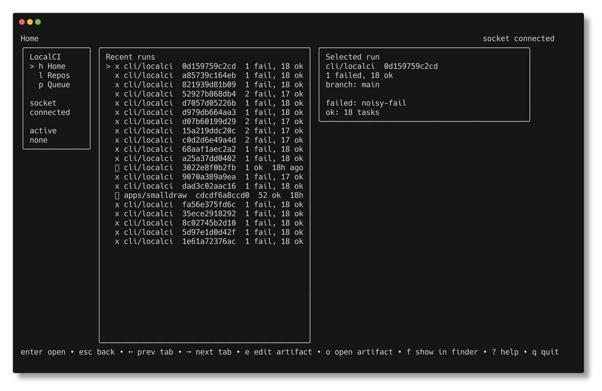
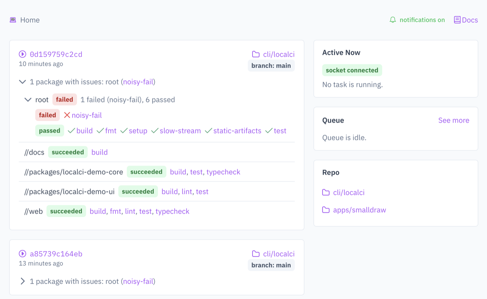

<p align="center">
  
</p>

# LocalCI: Continuous Integration On Your Own Computer

[](https://github.com/irskep/localci/actions/workflows/ci.yml)

Full documentation: <https://steveasleep.com/localci/>

CI systems run lots of checks on every commit, so you can catch as many errors as possible before your code is published. LocalCI lets you use that strategy on your laptop, no server needed. A postcommit hook asks a daemon to run all your tests serially in isolated shallow git clones, and then you can monitor status and view history through various means (CLI, web interface, interactive terminal UI), just like you would with GitHub Actions.

You can also have it run all tests on your working directory without cloning, as a quick way to check everything immediately.





## Your postcommit could look like this

```
> git commit -am "README overhaul"
[//:postcommit] $ ~/<redacted>/localci/mise-tasks/postcommit --repo /<redacted>/localci
Enqueued 1 task for /<redacted>/localci at 2b7535ffc423923a4c7cd2e27ee1e1d39ddb6575
Status: localci status --repo /<redacted>/localci --commit 2b7535ffc423923a4c7cd2e27ee1e1d39ddb6575
Results: http://127.0.0.1:61924/repo/<redacted>/localci/commit/2b7535ffc423923a4c7cd2e27ee1e1d39ddb6575

Wait: localci wait --repo /<redacted>/localci --commit 2b7535ffc423923a4c7cd2e27ee1e1d39ddb6575
[main 2b7535f] README overhaul
 3 files changed, 24 insertions(+), 186 deletions(-)
 delete mode 100644 web/README.md
```

## Why would you want to do this?

### Catch problems earlier by not relying on memory and discipline

During normal development, you (or, realistically, a coding agent) run contextual checks all the time. You run your typechecker, or the test that covers the work you’re doing. You run the linter to see if you introduced any issues. These local checks give you direct, immediate feedback on your work.

Then you open a PR, which runs CI, and—surprise!—a check failed that you didn't anticipate. You broke it three commits back but never noticed because you didn’t think to run that check.

If you had been using LocalCI, you could have done a quick history check before opening the PR, or even have a git hook show it to you when you push.

Having all results available immediately means you don’t have to consciously run a check and wait for the results. The results are just there.

### Reduce the role of GitHub Actions, or other CI web services, in your workflow

The internet is often fast, but there are major downsides to relying on a remote CI server for your core development iteration loop.

First, sending all your code to the cloud, starting a fleet of virtual machines, and downloading dependencies from a cache is a lot more work than just…running the test suite locally.

Second, the UI for browsing CI results on some services is just straight ass. 100 MB of JavaScript just to read your plaintext log file. Hierarchies that make no sense. Limits on how output can be browsed. Isn’t it fun to download a 100 MB tarball to look at Playwright’s HTML output?

With LocalCI, it’s all already on your own computer. You can use it on an airplane. The UI is less than 1 MB of JavaScript, which isn’t nothing, but at least there are no ad trackers. If you have a gripe, I’ll consider your suggestion because I am just a guy with a git repository, rather than letting your community forum topic languish for years.

## Limitations

1. You must define all checks as [Mise](https://mise.en.dev) tasks. Enlightened folks consider this a feature, not a bug.
2. There is no configuration. All tasks run in serial. This may change based on feedback.
3. As of May 2026, there is one user: me. But I do use it.

## Getting Started

Covered here in the docs: <https://steveasleep.com/localci/getting-started/>